<p align="center">
  
</p>

<h1 align="center">🧠 Smart Office Hybrid 4.0 — AI-Powered Dashboard</h1>

<p align="center">
  
  
  
  
  
</p>

---

## 🌎 Languages
- 👉 English: jump to [English Version](#english-version)
- 👉 Português: vá para a [Versão em Português](#versão-em-português)

---

## English Version

### 📌 Table of Contents
1. Summary
2. Visual Demo
3. Project Architecture
4. Technologies
5. APIs
6. Installation
7. Usage
8. AI Customization
9. Roadmap
10. Contribution
11. Credits
12. License

### 🚀 Summary
Smart Office Hybrid 4.0 is an AI-powered universal dashboard. It reads your existing business data (SQL tables/joins/models) to generate analytical charts, KPIs and insights. As a hybrid solution, you can plug it into any project that exposes data. If you need help defining the data, provide your database model (tables for `dso_grafico`, joins in `dso_grafico_join`, and chart models in `dso_model_grafico`) to your AI assistant (Groq, ChatGPT, Claude, etc.) and it can generate the setup you need.

### 🖼 Visual Demo
<div align="center">
  <table>
    <tr>
      <td>
        <details>
          <summary>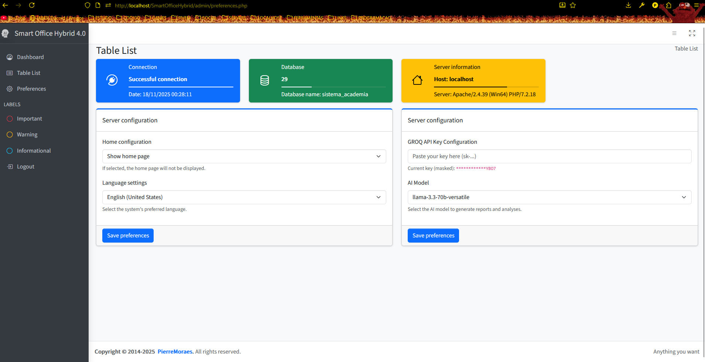</summary>
          
        </details>
      </td>
      <td>
        <details>
          <summary>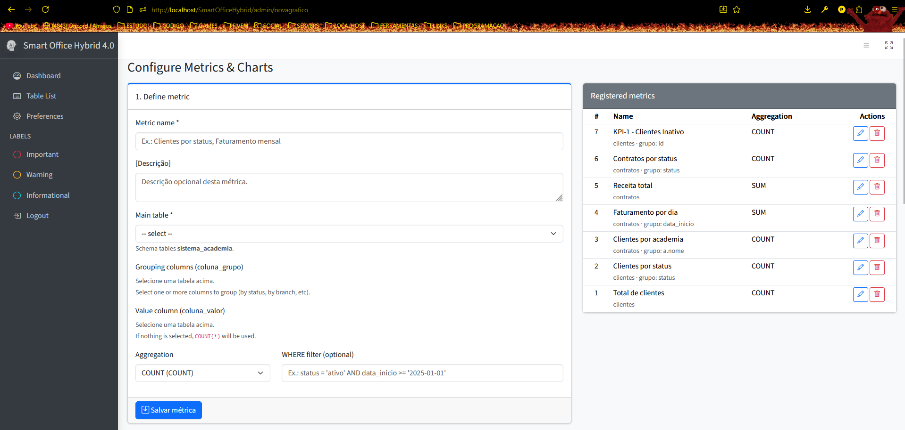</summary>
          
        </details>
      </td>
      <td>
        <details>
          <summary>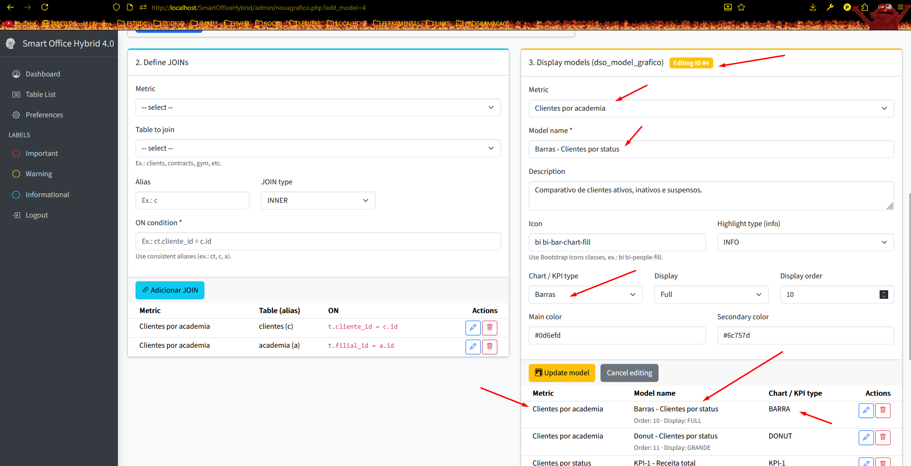</summary>
          
        </details>
      </td>
    </tr>
    <tr>
      <td>
        <details>
          <summary>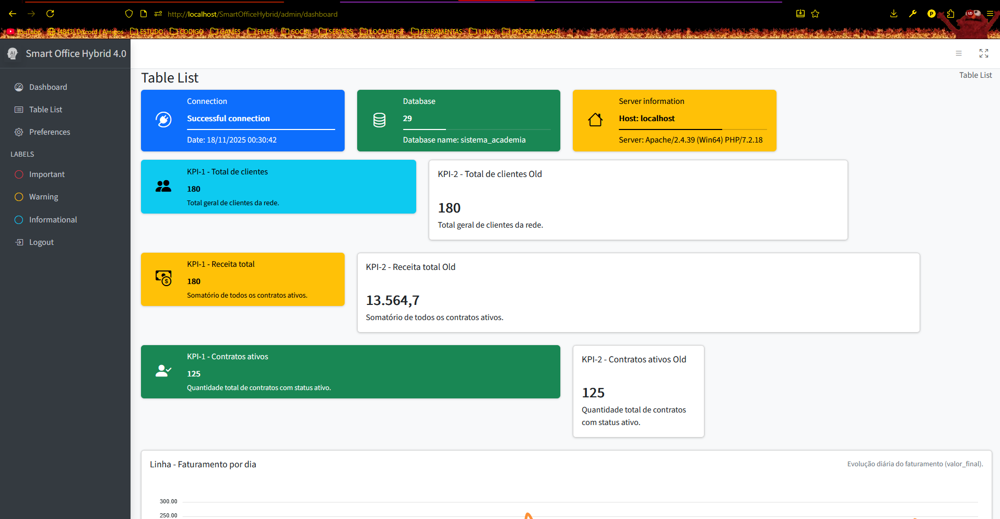</summary>
          
        </details>
      </td>
      <td>
        <details>
          <summary>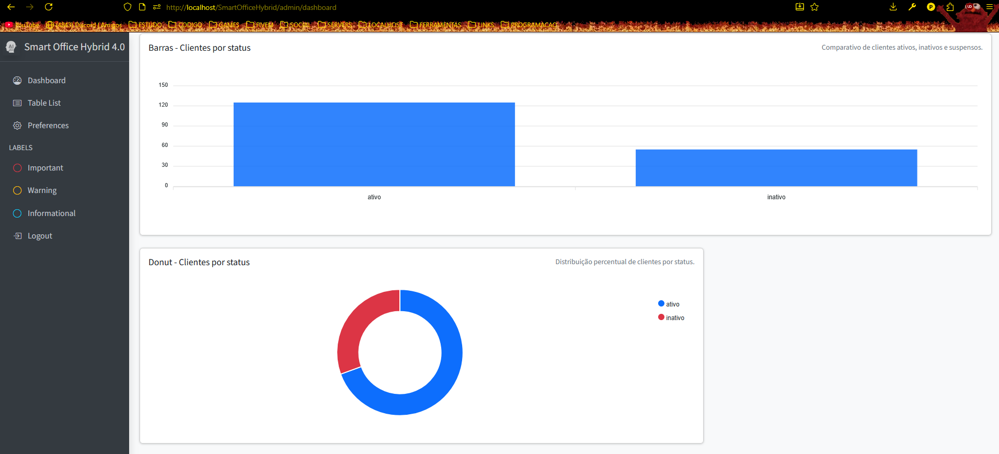</summary>
          
        </details>
      </td>
      <td>
        <details>
          <summary>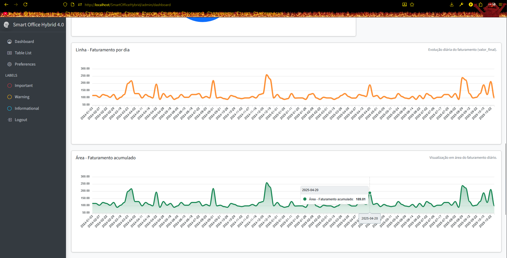</summary>
          
        </details>
      </td>
    </tr>
    <tr>
      <td>
        <details>
          <summary>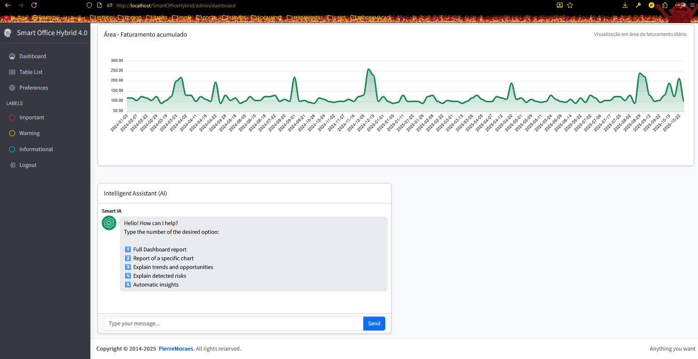</summary>
          
        </details>
      </td>
      <td>
        <details>
          <summary>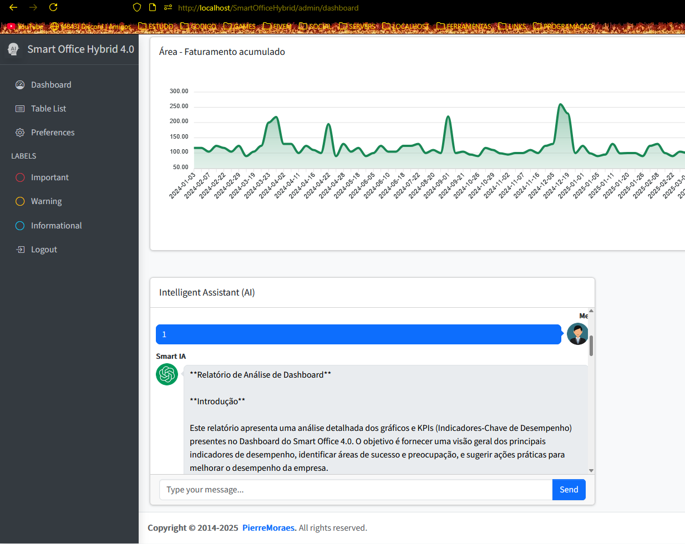</summary>
          
        </details>
      </td>
      <td>
        <details>
          <summary>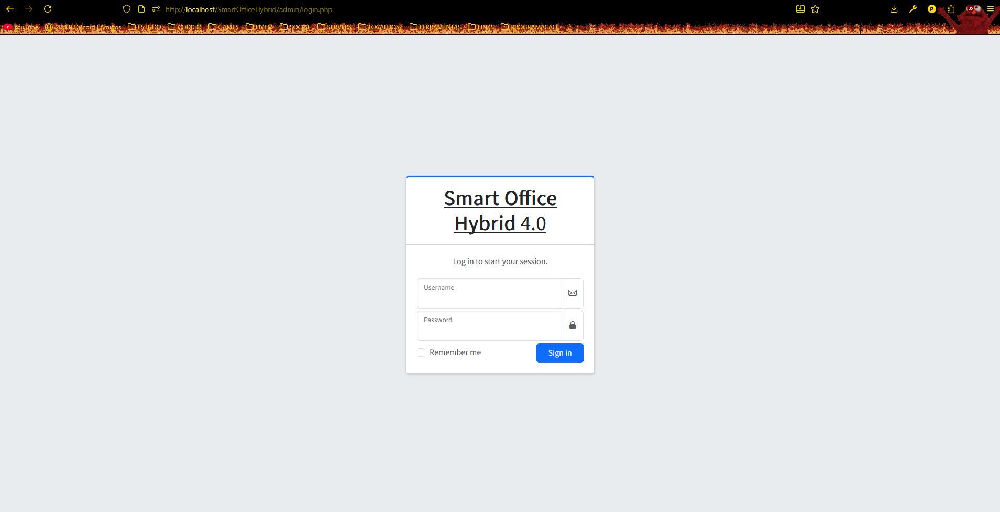</summary>
          
        </details>
      </td>
      <td>
        <details>
          <summary>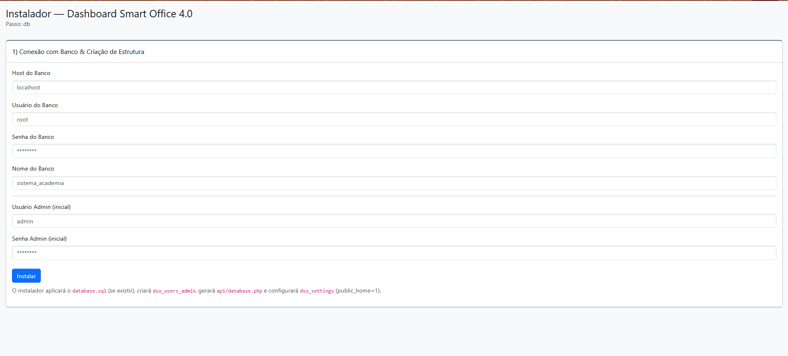</summary>
          
        </details>
      </td>
      <td>
        <details>
          <summary>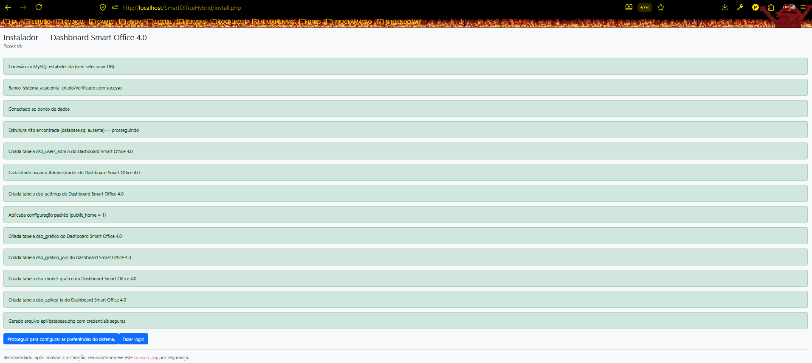</summary>
          
        </details>
      </td>
    </tr>
  </table>
</div>

### 🏗 Project Architecture

```
SmartOfficeHybrid/
├── .htaccess
├── home.php
├── index.php
├── install.php
├── readme.md
│
├── api/
│   ├── database.php         # Database connection (configured on install)
│   ├── functions.php        # General functions and AI helpers
│   ├── language.php         # i18n (PT-BR, EN-US, ES-ES)
│   └── list_columns.php     # Utility to list table columns for forms
│
├── admin/
│   ├── dashboard.php        # Admin dashboard (charts, KPIs)
│   ├── index.php
│   ├── login_redirect.php   # Loading and UX messages during operations
│   ├── login.php            # Admin login
│   ├── logout.php
│   ├── novagrafico.php      # Create new charts, edit table models
│   ├── preferences.php      # Admin preferences
│   └── includes/            # Headers, footers, menu
│
└── AdminLTE/                # AdminLTE theme (UI assets)
    ├── assets/ css/ docs/ examples/ forms/ generate/ js/ layout/ tables/ UI/ widgets/
```

### 🧰 Technologies
- AdminLTE, Chart.js, jQuery, Bootstrap
- PHP (PDO), MySQL
- Groq AI (intelligence layer)

### 🔌 APIs
- Groq API Docs: `https://console.groq.com/docs`
- Get your key: `https://console.groq.com/keys`

### 📥 Installation
- Prerequisites: WAMP/XAMPP (Apache + MySQL), PHP 7.2+
- Place this folder under your web server root (e.g., `c:/wamp64/www/SmartOfficeHybrid`).
- Start Apache and MySQL.
- Visit `http://localhost/SmartOfficeHybrid/install.php` to run the setup wizard.
- The setup wizard automatically creates/imports the database. A backup is available in `Docs/database.sql` for manual import (phpMyAdmin) if needed.
- Database credentials and `api/database.php` are generated and configured automatically by the installer (manual edits are typically unnecessary).
- Configure the Groq API key and model in the Admin Preferences page (`admin/preferences.php`). From there you can also choose whether to show a home page before login and set the site language. Advanced users may override integration in `api/functions.php`.
- Access: `http://localhost/SmartOfficeHybrid/` (Admin: `http://localhost/SmartOfficeHybrid/admin/`).

### ▶️ Usage
- Log in to the Admin area.
- Use “Create New Graph” to define chart models from your tables/joins.
- Explore the dashboard for KPIs and insights.
- Use the AI chat to request reports or explanations based on your data.

### 🤖 AI Customization
- The chat options are processed by `dso_process_chat_message` in `api/functions.php` and translated labels in `api/language.php`.
- Add new options by handling a new `$msg` value:

```php
// api/functions.php
if ($msg === '1') {
    $prompt = $lang->get('parametros_iaa')
            . $lang->get('parametros_iaaa')
            . $lang->get('parametros_iaaaa')
            . json_encode($dashboardData, JSON_UNESCAPED_UNICODE);

    return dso_ia_dashboard_ask($pdo, $prompt);
}
// Add more: elseif ($msg === '2') { ... }
```

- Add menu labels and texts in `api/language.php`:

```php
// api/language.php
'chat_menu' => "Hello! How can I help?\nChoose an option:\n\n1) Full dashboard report\n2) Specific chart report\n3) Trends and opportunities\n4) Detected risks\n5) Automatic insights",

// Example of a new label
'new_label' => 'New Info',
```

### 🗺 Roadmap
- [x] Dashboard
- [x] Preferences
- [x] Create New Graph
- [x] KPI System
- [x] Groq AI Integration
- [x] Install Wizard

### 🤝 Contribution
- Developed by Pierre Moraes
- University: UNISUAM — Universidade Augusto Motta
- Course: Análise e Desenvolvimento de Sistemas

### 🏅 Credits
- AdminLTE (Free): `https://github.com/ColorlibHQ/AdminLTE/releases`
- Groq AI Docs: `https://console.groq.com/docs`

### 📜 License
- CC BY-NC 4.0 — Non-commercial use only
[](https://creativecommons.org/licenses/by-nc/4.0/)


---

## Versão em Português

### 📌 Índice
1. Resumo
2. Demonstração Visual
3. Arquitetura do Projeto
4. Tecnologias
5. APIs
6. Instalação
7. Uso
8. Personalização de IA
9. Roadmap
10. Contribuição
11. Créditos
12. Licença

### 🚀 Resumo
Smart Office Hybrid 4.0 é um dashboard universal com IA. Ele lê seus dados de negócio (tabelas/joins/modelos) para gerar gráficos analíticos, KPIs e insights. Por ser híbrido, pode ser plugado em qualquer projeto que exponha dados. Se precisar de ajuda para definir os dados, forneça seu modelo de banco (tabelas em `dso_grafico`, joins em `dso_grafico_join` e modelos de gráficos em `dso_model_grafico`) para sua IA (Groq, ChatGPT, Claude, etc.) e ela pode gerar o setup desejado.

### 🖼 Demonstração Visual
<div align="center">
  <table>
    <tr>
      <td>
        <details>
          <summary></summary>
          
        </details>
      </td>
      <td>
        <details>
          <summary></summary>
          
        </details>
      </td>
      <td>
        <details>
          <summary></summary>
          
        </details>
      </td>
    </tr>
    <tr>
      <td>
        <details>
          <summary></summary>
          
        </details>
      </td>
      <td>
        <details>
          <summary></summary>
          
        </details>
      </td>
      <td>
        <details>
          <summary></summary>
          
        </details>
      </td>
    </tr>
    <tr>
      <td>
        <details>
          <summary></summary>
          
        </details>
      </td>
      <td>
        <details>
          <summary></summary>
          
        </details>
      </td>
      <td>
        <details>
          <summary></summary>
          
        </details>
      </td>
      <td>
        <details>
          <summary></summary>
          
        </details>
      </td>
      <td>
        <details>
          <summary></summary>
          
        </details>
      </td>
    </tr>
  </table>
</div>

### 🏗 Arquitetura do Projeto

```
SmartOfficeHybrid/
├── .htaccess
├── home.php
├── index.php
├── install.php
├── readme.md
│
├── api/
│   ├── database.php         # Conexão com banco (configurada na instalação)
│   ├── functions.php        # Funções gerais e helpers de IA
│   ├── language.php         # i18n (PT-BR, EN-US, ES-ES)
│   └── list_columns.php     # Utilitário para listar colunas de tabelas
│
├── admin/
│   ├── dashboard.php        # Dashboard admin (gráficos, KPIs)
│   ├── index.php
│   ├── login_redirect.php   # Loading e mensagens de UX durante operações
│   ├── login.php            # Login administrativo
│   ├── logout.php
│   ├── novagrafico.php      # Criar novos gráficos, editar modelos de tabela
│   ├── preferences.php      # Preferências do admin
│   └── includes/            # Cabeçalhos, rodapés, menu
│
└── AdminLTE/                # Tema AdminLTE (ativos de UI)
    ├── assets/ css/ docs/ examples/ forms/ generate/ js/ layout/ tables/ UI/ widgets/
```

### 🧰 Tecnologias
- AdminLTE, Chart.js, jQuery, Bootstrap
- PHP (PDO), MySQL
- Groq AI (camada de inteligência)

### 🔌 APIs
- Documentação Groq: `https://console.groq.com/docs`
- Crie sua chave: `https://console.groq.com/keys`

### 📥 Instalação
- Pré-requisitos: WAMP/XAMPP (Apache + MySQL), PHP 7.2+
- Copie a pasta do projeto para o diretório raiz do servidor web (ex.: `c:/wamp64/www/SmartOfficeHybrid` ou `https://www.site.com/SmartOfficeHybrid`).
- Inicie os serviços `Apache` e `MySQL`.
- Acesse `http://localhost/SmartOfficeHybrid/install.php` para iniciar o assistente de instalação.
- O assistente (`install.php`) cria e importa o banco automaticamente. Há um backup em `Docs/database.sql` para uso manual (phpMyAdmin), se necessário.
- Após concluir a instalação, o acesso direto a `install.php` será bloqueado; você será redirecionado para a `home` ou para o `login`, conforme sua escolha.
- As credenciais e `api/database.php` são geradas e configuradas automaticamente pelo `install.php` (não é preciso editar manualmente).
- Configure a chave e o modelo da Groq no painel de Preferências (`admin/preferences.php`). Lá você também escolhe se exibe uma página `home` antes do login e define o idioma do site. Ajustes avançados podem ser feitos em `api/functions.php`.
- Acesse: `http://localhost/SmartOfficeHybrid/` (Admin: `http://localhost/SmartOfficeHybrid/admin/`).

### ▶️ Uso
- Faça login na área Admin.
- Use “Criar Novo Gráfico” para definir modelos a partir de tabelas/joins.
- Explore o Dashboard para KPIs e insights.
- Use o chat de IA para solicitar relatórios ou explicações baseadas nos seus dados.

### 🤖 Personalização de IA
- As opções do chat são processadas por `dso_process_chat_message` em `api/functions.php` e labels em `api/language.php`.
- Adicione novas opções tratando um novo valor de `$msg`:

```php
// api/functions.php
if ($msg === '1') {
    $prompt = $lang->get('parametros_iaa')
            . $lang->get('parametros_iaaa')
            . $lang->get('parametros_iaaaa')
            . json_encode($dashboardData, JSON_UNESCAPED_UNICODE);

    return dso_ia_dashboard_ask($pdo, $prompt);
}
// Ex.: elseif ($msg === '2') { ... }
```

- Adicione labels/menus em `api/language.php`:

```php
// api/language.php
'chat_menu' => "Olá! Como posso ajudar?\nDigite o número da opção:\n\n1) Relatório completo do Dashboard\n2) Relatório de um gráfico específico\n3) Tendências e oportunidades\n4) Riscos detectados\n5) Insights automáticos",

// Exemplo de nova label
'new_label' => 'Nova Informação',
```

### 🗺 Roadmap
- [x] Dashboard
- [x] Preferências
- [x] Criar Novo Gráfico
- [x] Sistema de KPI
- [x] Integração com Groq AI
- [x] Assistente de Instalação

### 🤝 Contribuição
- Desenvolvido por Pierre Moraes
- Universidade: UNISUAM — Universidade Augusto Motta
- Curso: Análise e Desenvolvimento de Sistemas

### 🏅 Créditos
- AdminLTE (Free): `https://github.com/ColorlibHQ/AdminLTE/releases`
- Groq AI Docs: `https://console.groq.com/docs`

### 📜 Licença
- CC BY-NC 4.0 — Uso não comercial
[](https://creativecommons.org/licenses/by-nc/4.0/)
